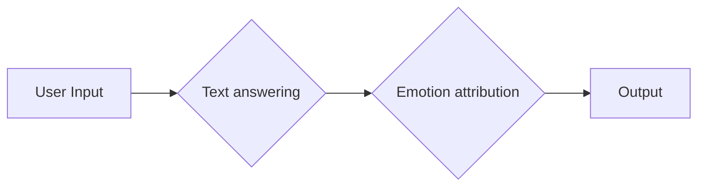

# CHR bot

#### Description:
A simple software to answer to questions with film phrase.

> *The Chinese Room conundrum **argues that a computer cannot have a mind of its own and attaining consciousness is an impossible task for these machines**. They can be programmed to mimic the activities of a conscious human being but they can't have an understanding of what they are simulating on their own*
[analyticsindiamag.com](https://analyticsindiamag.com/chinese-room-experiment-genereal-ai/)

Scenarist  write a script,
Directors create films from that script,
CHR bot uses that script to give you ~~logic~~ answer

## So what is CHR bot doing?

It gives you simple answers! It's main future is to handle small talk conversations and express them with emojis.

### How to use?
Run, and express yourself! So simple, isn't it?

## How it works?
### We can divide this bot to 2 parts
1st is to answer to user text
2nd is to choose right emotion to express

**Text answering** part consisted to simply search in a film dialogue database similar expression and to output next phrase.
So there is a bunch of dialogues and conversations in films ... why to not just use them?
~~*Also, there is another solution for this problem (Machine learning, BERT, NLP)*~~
But here we will simply use API for scrap answer

**Emotion attribution** part is to pick right emotion
Text2emotion can define and choose between 6 emotions so we will have more "real" conversation experience

|||
|--|--|
|😊| Happy |
|😡| Angry |
|😯| Surprise |
|😞|Sad  |
|😨| Fear |
|*"nothing"*| poker face |

# Technical part
## Graphical explain

## Brief function explain

**film_search**

Searches for the phrase with the help of the API
From the results we will get random film TitleID and PhraseID

**answer_extract**

it will simply extract next phraseID of film
So it will be the nearest phrase found in the film and
answer_extract will take the next phrase (the answer to our input)

*There are some cases for different answers
For example function will output 2 lines if the first one finished with "..." or "!"*

**emotion_checker**

With text2emotions we will scan text for emotions,
and output emoji

*Basicly text2 emotion outputs 5 emotions with coefficient 0 to 1
So, for simplicity the emotion with max value will be chosen
(Or no emotion if all values are == 0)*

# Resuirements

You can find **requirements.txt** in the root folder

There you will find

    pytest==7.2.1
    requests==2.28.2
    -e git+https://github.com/takes0/text2emotion-library.git#egg=text2emotion
    #I modified a little bit the original library of text2emotion.
    #So, please be sure that for this project you download my fork